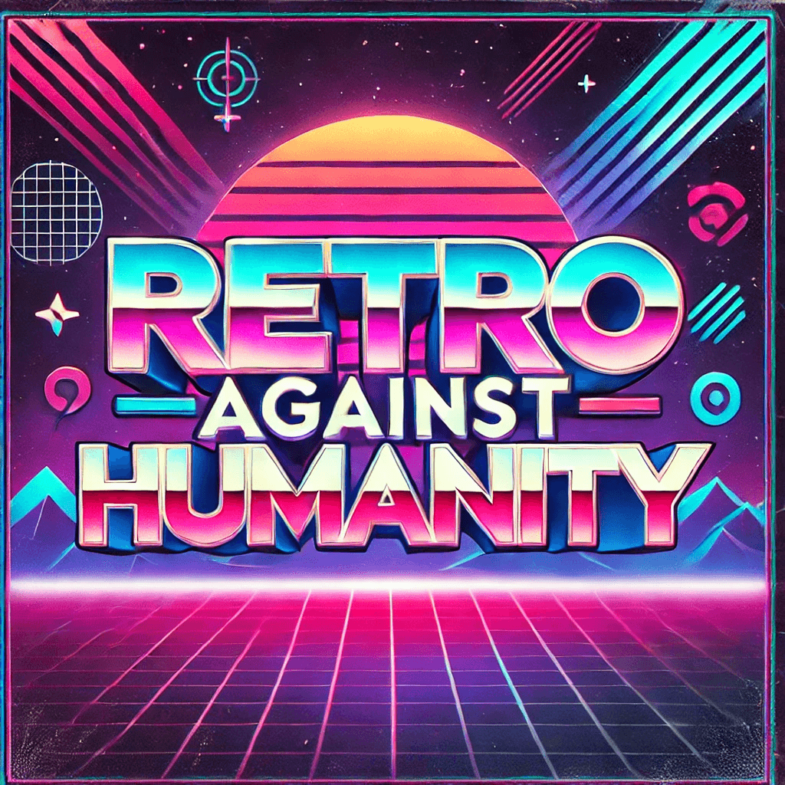

# Retro Against Humanity

A fun, interactive statement generator inspired by Cards Against Humanity, specifically designed for agile retrospectives. 
This project is built using simple HTML, CSS, and JavaScript, allowing teams to generate "good", "bad", "improvement", and "star" statements for retrospective meetings with a click of a button.

This activity is inspired by the work of [Box UK](https://www.boxuk.com/insight/retros-against-humanity/).

## Usage

[Use it here!](https://cesarmiguel85.github.io/RetroAgainstHumanity/)

## Features

- Randomly generates fun and engaging retrospective statements.
- Categories: **Good cards**, **Bad cards**, **Improvement cards**, and **Stars**.
- Fully responsive design with fun visuals.
- All functionality is handled client-side for fast performance.
- No dependencies on external APIs or services.

Come on, it cannot get any dumber than this! It is a single html page... 😅
